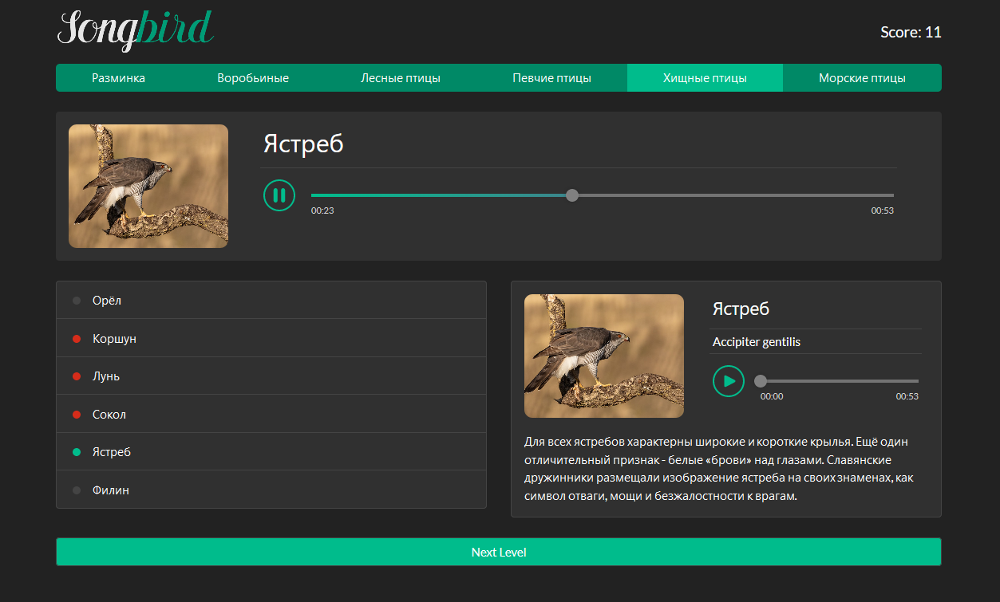

| Deadline         |Repo name    | Branch name |
| ---------------- | ----------- | ----------- |
| 30.08.2020 23:59 | songbird    | songbird    |

# songbird

Songbird - одностраничное приложение, викторина для распознавания птиц по их голосам.

1. Task: https://github.com/rolling-scopes-school/tasks/blob/master/tasks/songbird.md
2. Screen: https://imgur.com/a/txjZxko
3. Completed task: https://romanenkoandrew-songbird.netlify.app/
4. 31.08.2020 / 30.08.2020
5. Max score: 240 points
6. Score: 200 points

## Структура приложения

Игровое поле викторины состоит из четырёх блоков: 
1. header
2. блок с текущим вопросом
3. блок с вариантами ответов
4. блок с описанием птицы

## Описание основных блоков

- header содержит название или логотип приложения, счёт игры, список вопросов.  
- блок с вопросом содержит аудиоплеер с записью голоса птицы и заглушки на месте названия и изображения птицы. Когда игрок выбирает правильный ответ, в блоке с вопросом отображаются название и изображение птицы, голос которой звучал.  
- блок с вариантами ответов содержит список с названиями шести разных птиц.  
- блок с описанием птицы содержит данные о ней: изображение, русское и латинское название, аудиозапись голоса, короткая информация.

## Механизм игры

- птица в блоке с вопросом рандомно выбирается из списка с вариантами ответов
- при клике по одному из пунктов списка с вариантами ответов, в блоке с описанием птицы выводятся информация о ней
- если игрок выбрал правильный ответ, в блоке с вопросом выводится название и изображение птицы
- на старте игры score: 0. Если игрок дал правильный ответ с первой попытки, его счёт увеличивается на 5 баллов, каждая следующая попытка даёт на один балл меньше, если правильный ответ дан только с последней, шестой попытки, игрок получает за него 0 баллов
- для правильных и неправильных ответов игрока используется звуковая и цветовая индикация
- когда игрок дал правильный ответ, активируется кнопка "Дальше" и он получает возможность перейти к следующему вопросу
- после последнего вопроса выводится счёт игры: "Вы набрали *** баллов из *** возможных. 
- если набрано не максимально возможное количество баллов, игроку предлагается пройти викторину ещё раз
- если набрано максимально возможное количество баллов, выводится поздравление и уведомление об окончании игры.

## Критерии оценки:
**Максимальный балл за задание: 240 баллов**  

- [x] **Вёрстка, дизайн, UI: (+30)**
  - [x] минимальная ширина страницы, при которой приложение отображается корректно – 320 рх
  - [x] внешний вид приложения полностью повторяет демо или является его улучшенной версией
  
- **Аудиоплеер: (+30)**
  - [x] стандартный: (+10)
  - [x] кастомный, такой же, как в демо приложения, может отличаться по цвету: (+10) 
  - [x] у кастомного аудиоплеера есть регулятор громкости звука: (+10)    
    Для кастомизации аудиоплеера можно использовать библиотеки

- **Контент: (+20)**
  - [x] использование заранее подготовленных данных: ( 0 )
  - [x] создание и использование собственной коллекции данных, либо использование подходящего API: (+20)

- **Header: (+20)**
  - [x] правильное отображение текущего счета игры: (+10)
  - [x] индикация текущего вопроса: (+10)
  
- **Блок с вопросом: (+20)**
  - [x] подстановка дефолтного изображения и замена названия птицы на символы (\*\*\*), пока игрок не выберет правильный ответ: (+10)
  - [x] при выборе правильного ответа появляется изображение и название птицы: (+10)

- **Блок с вариантами ответов (названия птиц): (+30)**
  - [x] цветовая индикация правильного/неправильного ответа в виде индикаторов разного цвета рядом с названием птицы: (+20)
  - [x] при клике по названию птицы в блоке с описанием птицы отображается информацию о ней: (+10)   
  [ ]  Если правильный ответ уже дан, возможность просматривать описания птиц при клике по названию остаётся, цвет индикаторов при этом не изменяется.

- **Блок с описанием птицы: (+30)**
  - [x] пока игрок не кликнул по названию птицы из списка, в блоке выводится короткий текст с предложением послушать плеер и выбрать название птицы, чей голос прозвучал: (+10)
  - [x] при клике по названию птицы из списка, в блоке с описанием птицы появляется актуальная информация о ней: (+20)  
  Информация о птице включает:
    - изображение
    - название (на русском и на латыни)
    - аудиоплеер с записью голоса
    - дополнительное описание птицы.
    
- **Кнопка перехода к следующему вопросу: (+30)**
  - [x] пока не выбран правильный ответ, кнопка не активна, нет возможности перейти к следующему заданию. Активное и неактивное состояние кнопки визуально отличаются, например, активная кнопка имеет зеленый, не активная - серый цвет: (+10)
  - [ ] после правильного ответа на последний вопрос, клик по кнопке скрывает блок с вопросом, блок с вариантами ответов и блок с описанием птицы. Появляется сообщение с поздравлением об окончании игры: (+20)  
  Сообщение содержит количество набранных баллов из максимально возможных и кнопку с предложение сыграть ещё раз. 
  
- **Extra scope: (+30)**
  - [ ] звуковая индикация правильного/неправильного ответа: (+20)  
    - при выборе правильного или неправильного ответа издаются разные звуковые сигналы
    - при выборе неправильного ответа проигрывание аудиоплеера не должно останавливаться
    - при выборе правильно ответа проигрывание аудиоплеера должно остановиться
  - [ ] Поздравление с абсолютной победой, если набрано максимально возможное количество баллов: (+10)  
  Здесь можно проявить свою фантазию. Это может быть все, что угодно. Например:  картинка, анимация, видео, ссылка на что-то интересное, сертификат знатока птичьих голосов, слоган "теперь ты знаешь кто чирикнул" и т.д  
  Для удобства проверки правильные ответы выведите в консоль.

## Штрафы
- [ ] любой сбой/поломка приложения, связанная с действиями пользователя: -20  
  Неправильный подсчёт баллов, нет перехода на следующую страницу, выводится неверная информация и т.д. Этот пункт не касается ошибок в консоли.
